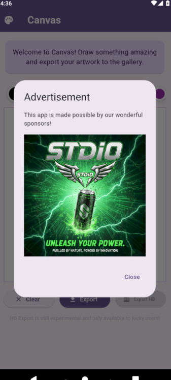
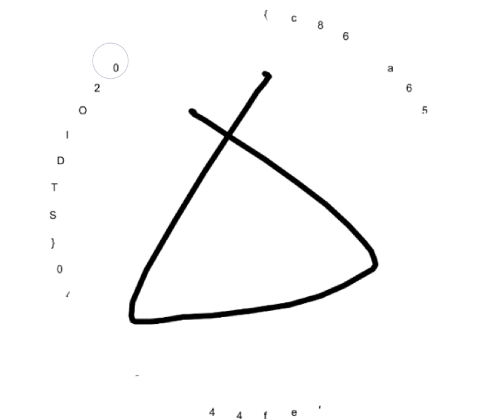

# STDiO CTF 2025
# 🔥🔥 Canvas — 1000 pts ฉบับสรุปแบบขอสั้นๆ
> **The experimental feature is only available for lucky users. Your luck is quite bad so no chance!**  
> Luckily, you are a legendary hacker and could probably find your way around it. 😎  
> **Mission:** Export your drawing in HD  
> ❗Note: You better run this app on ARM64 phone/emulator. x86 is also okay but x100 difficulty.  

> **Author:** runrun

Everything is open source if you know assembly :)
- https://conference.hitb.org/hitbsecconf2023hkt/materials/D2%20COMMSEC%20-%20B(l)utter%20%E2%80%93%20Reversing%20Flutter%20Applications%20by%20using%20Dart%20Runtime%20-%20Worawit%20Wangwarunyoo.pdf
- https://filestore.fortinet.com/fortiguard/research/nullcon.pdf
- https://www.guardsquare.com/blog/how-classical-attacks-apply-to-flutter-apps




# คิดง่ายๆน่าจะ patch มันสะ เพราะลองเปิดแอพมาแล้วมันขึ้น Ad เด้งมาปิดก็เด้งกลับมา ผมเลยคิดว่าต้องหาวิธีปิดมันสะ


### 1) หาส่วนของ Ad และจะ patch  เพื่อปิดมัน (`_showAd`)
เข้า `libapp.so` (ARM64) หา `_showAd` แล้วสั่งให้มันกระโดดไป `ReturnAsyncNotFutureStub` เลย
```python
from pathlib import Path
f = Path("canvas_dec/lib/arm64-v8a/libapp.so").open('r+b')
f.seek(0x2f1ea8)
f.write(bytes.fromhex('d1cdfc17'))
f.close()
```

### 2) Export HD 
ที่ offset `0x3024e4` เปลี่ยน `tbz` ให้กลายเป็น `b` จบ
```python
from pathlib import Path
with Path("canvas_dec/lib/arm64-v8a/libapp.so").open('r+b') as f:
    f.seek(0x3024e4)
    f.write(bytes.fromhex('05000014'))
```


### 3) build มันสะ ละติดตั้งลง Emulator
```bash
cd canvas_dec
zip -q0 ../canvas_hd_unsigned.apk resources.arsc
zip -qr ../canvas_hd_unsigned.apk . -x resources.arsc
cd ..
zipalign -p 4 canvas_hd_unsigned.apk canvas_hd_aligned.apk
apksigner sign --ks canvas.keystore --out canvas_hd.apk canvas_hd_aligned.apk
adb install -r canvas_hd.apk
```

## เสร็จแล้ว
1. เปิดแอป วาดๆ แล้วกด Export
2. และไปดูภาพที่ได้มาจะพบกับ Flag แค่นั้นแหละ
นำรูปที่ export ได้มาแสดงด้านล่างนี้:




## ครั้งแรกที่ลงแข่งรายการ STDiO CTF 
- สนุกมากครับ ขอบคุณทีมงานทุกคนเลยสนุกมากกกกกกกก
- ขอบคุณ AI ทุกเจ้าที่ทำให้ผม solve ข้อยากๆได้ฮ่าฮ่า
- ขอบคุณ Certificate First Blood of "Sanity Check"😅
